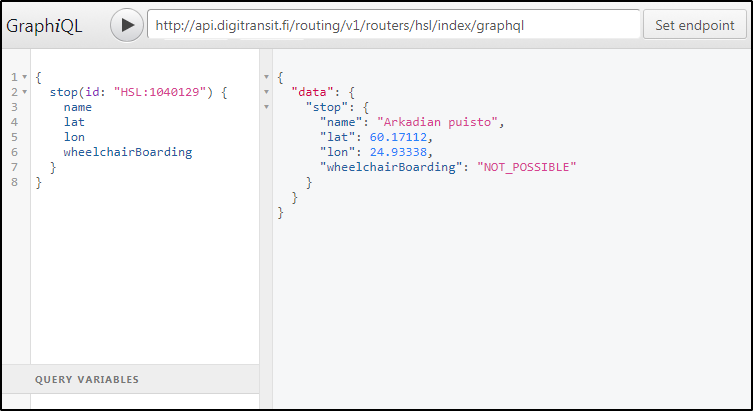
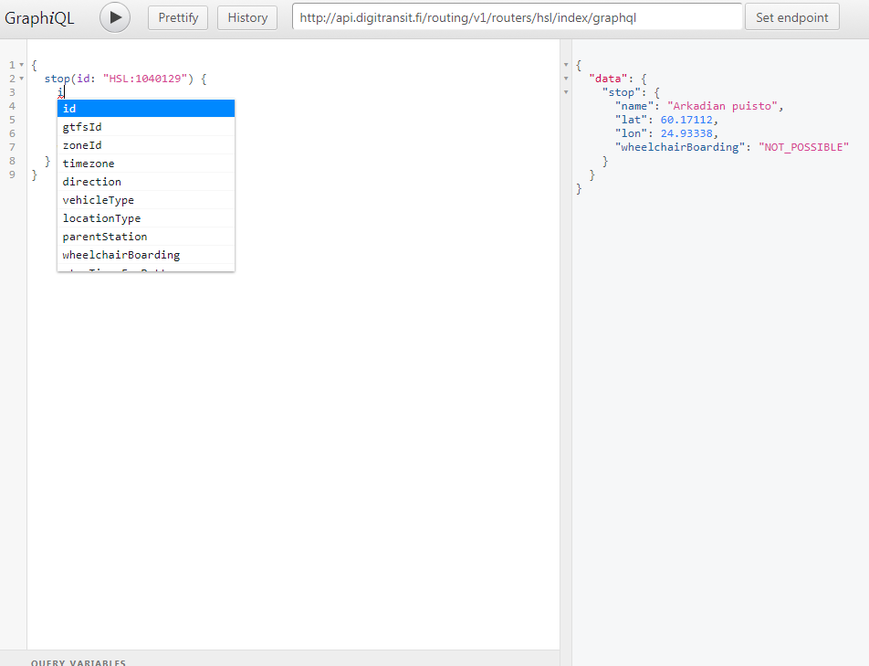
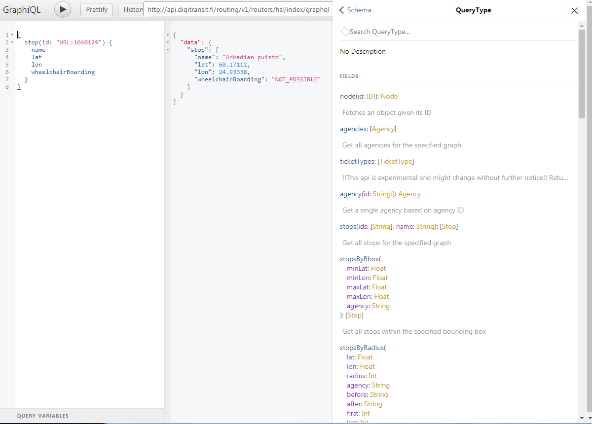
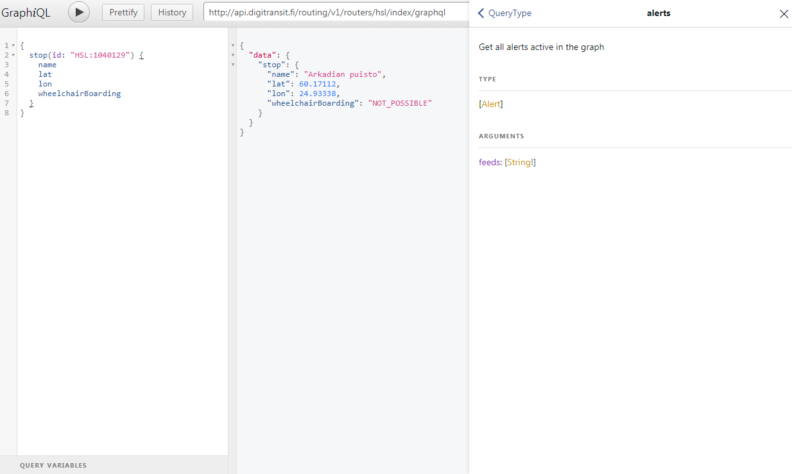
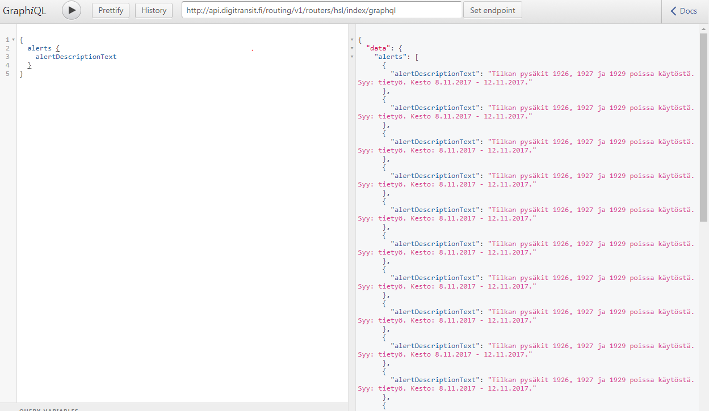

## Making queries and exploring schema using GraphiQL

**It is highly recommended to use GraphiQL.**

[GraphiQL](https://github.com/graphql/graphiql) is a simple UI for making queries. Not only can you use it for running queries but also for exploring GraphQL schema. 

**Note:** All top level queris should have at least some description available and you can use documentation browser to familiarize yourself with the schema.

There are a few options for using GraphiQL:

1) A browser extension like ChromeiQL (https://chrome.google.com/webstore/detail/chromeiql/fkkiamalmpiidkljmicmjfbieiclmeij)
2) Using browser versions for the three regions available:

Helsinki region:
> https://api.digitransit.fi/graphiql/hsl

Waltti regions:
> https://api.digitransit.fi/graphiql/waltti

Finland version:
> https://api.digitransit.fi/graphiql/finland

The browser versions have the correct endpoint configured already.

3) For Mac OSX you can use desktop version: [GraphiQL app](https://github.com/skevy/graphiql-app)

All options work similarly and UI looks more or less like this (ChromeiQL extension has been used in the example below):



## Execute your first query

1. If you are using GraphiQL app or browser extension, set "GraphQL Endpoint" to one of:
- Helsinki region: http://<i></i>api.digitransit.fi/routing/v1/routers/hsl/index/graphql
- Waltti regions: http://<i></i>api.digitransit.fi/routing/v1/routers/waltti/index/graphql
- Finland: http://<i></i>api.digitransit.fi/routing/v1/routers/finland/index/graphql

2. Copy this as query:

```
{
  stop(id: "HSL:1040129") {
    name
    lat
    lon
    wheelchairBoarding
  }
}
```

4. Press play to execute query

5. You should get result:

```
{
  "data": {
    "stop": {
      "name": "Arkadian puisto",
      "lat": 60.17112,
      "lon": 24.93338,
      "wheelchairBoarding": "NOT_POSSIBLE"
    }
  }
}
```

## Exploring schema with GraphiQL

GraphiQL is schema aware. This means that you can invoke autocomplete by Ctrl-space. Tool then shows available options for query.



## Reading schema docs

By clicking "< docs" from upper right corner, you open documentation explorer. From there click on "query: QueryType" opens all top level queries available.



From here we can check e.g. "alerts", which describes what can be queried using that top level. It says "Get all alerts active in the graph".



Let's try to query that:

1. Close docs

2. Enter query
```
{
  alerts {
    alertDescriptionText
  }
}
```

3. Press "play" to execute your query


Depending on current situation you might get some disruption info


